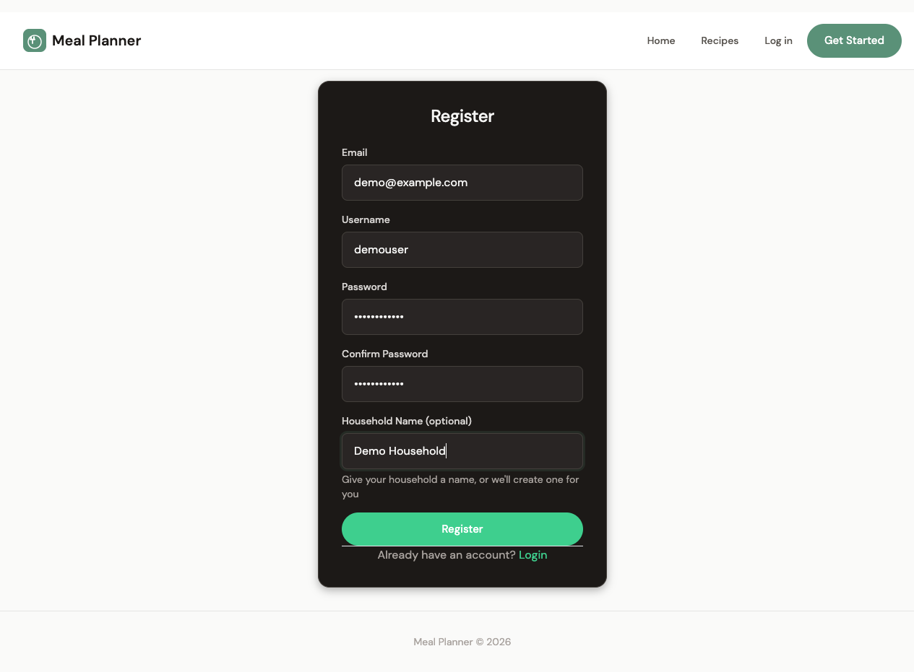
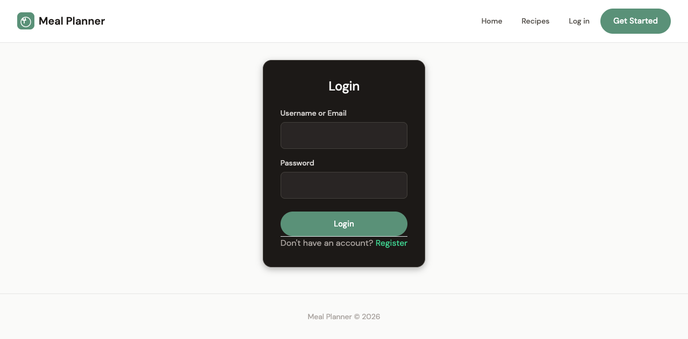
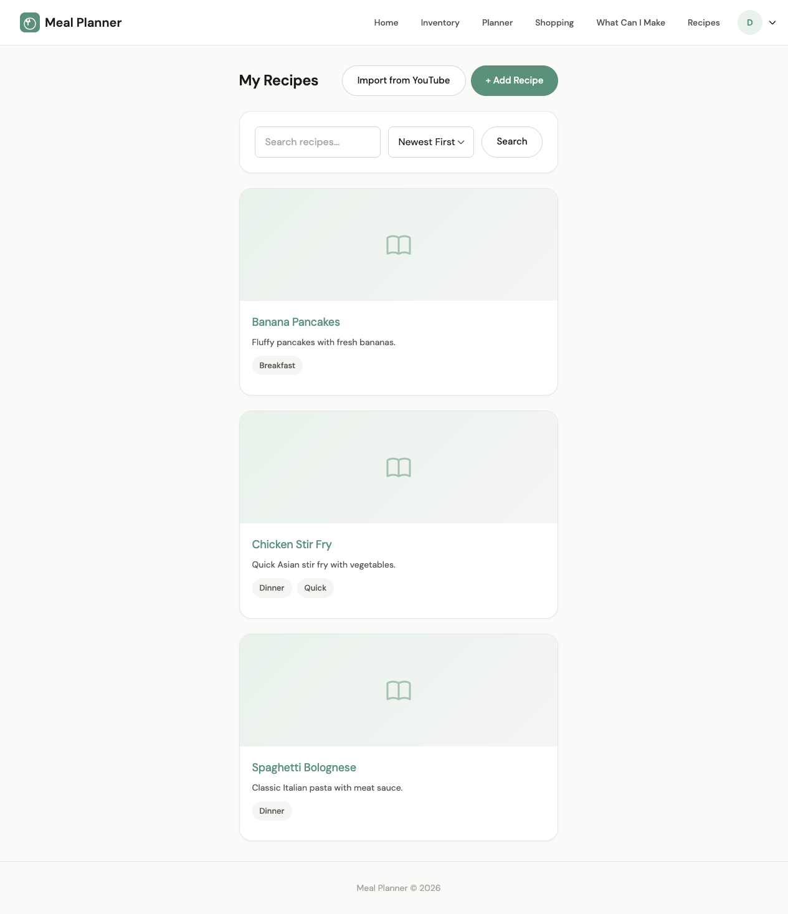
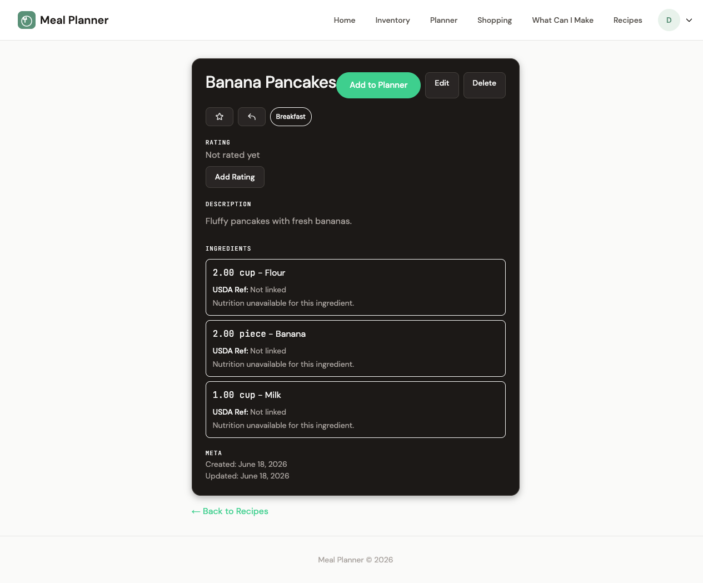
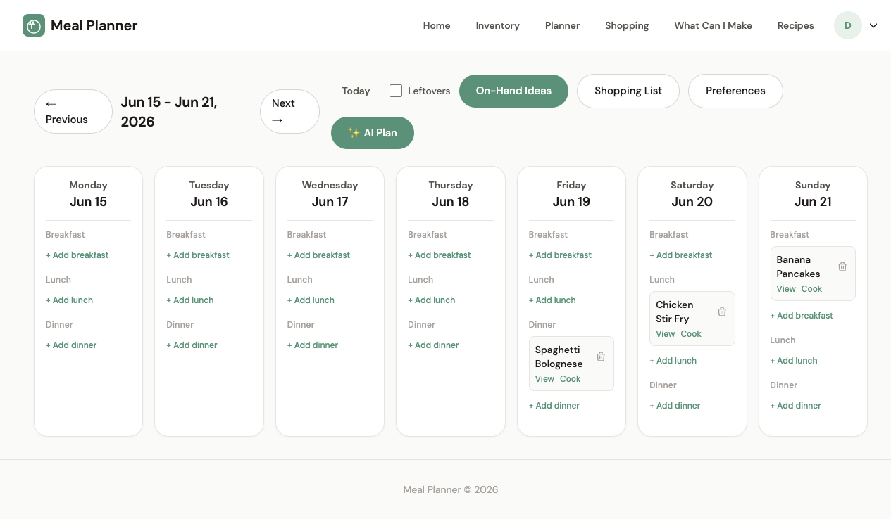
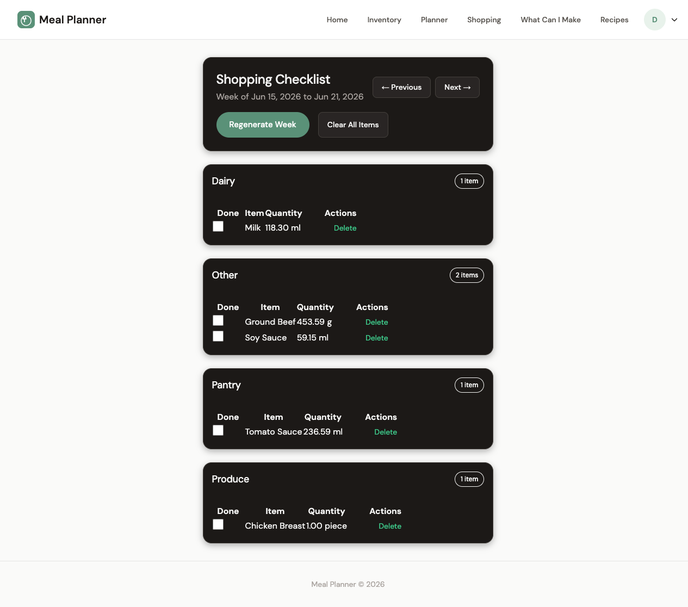
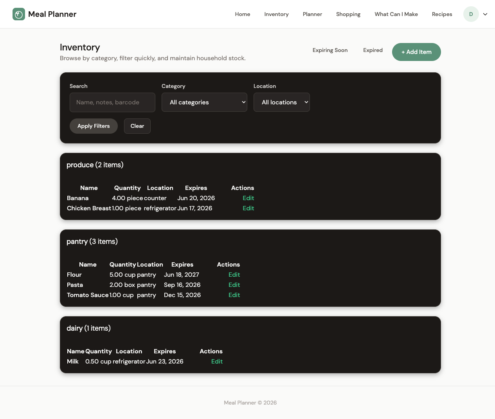
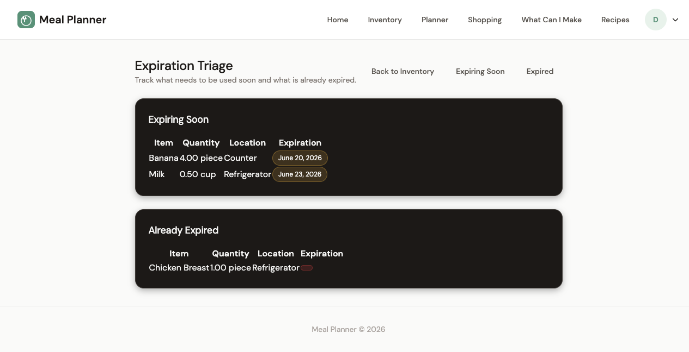
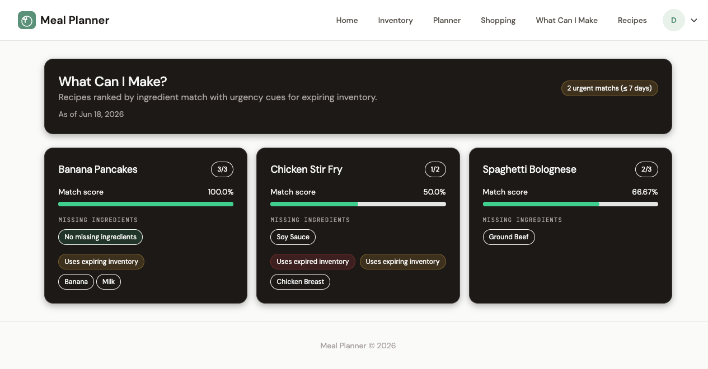

# MealPlanner User Manual

A comprehensive guide to managing your household's meals, recipes, shopping lists, and inventory.

---

## Table of Contents

1. [Getting Started](#1-getting-started)
2. [Recipes](#2-recipes)
3. [Meal Plans](#3-meal-plans)
4. [Shopping List](#4-shopping-list)
5. [Inventory](#5-inventory)
6. [Ingredient Discovery](#6-ingredient-discovery)
7. [AI-Assisted Meal Planning](#7-ai-assisted-meal-planning)
8. [Backup & Restore](#8-backup--restore)
9. [Account & Settings](#9-account--settings)

---

## 1. Getting Started

### Creating an Account

Navigate to the app and click **Sign Up** in the nav bar.

Fill out the registration form:

- **Email** — required, must be unique
- **Username** — required, must be unique
- **Password** — minimum 8 characters with complexity requirements
- **Household Name** — optional, defaults to "My Household" if blank

After submitting, you're logged in automatically and redirected to the home page.

### Logging In

Click **Log In** in the nav bar. You can use either your **username** or **email** to sign in. Casings (uppercase/lowercase) are handled automatically.

---

## 2. Recipes

### Browsing Recipes

The recipe list (`/recipes/`) shows all recipes belonging to your household.

**Sorting & filtering:**
- **Search** — filter by title or description
- **Sort** — Newest First, Oldest First, Highest Rated, or Title A-Z
- Recipes flagged with `needs_review` are shown with a **pending review badge**

Each recipe card shows the title, description preview, average star rating, and associated tags.

### Viewing a Recipe

Click any recipe card to see its detail page:

- Full description
- **Ingredients list** with quantities and units
- **Step-by-step instructions** (ordered)
- **Average star rating** and your personal rating form
- **Tags** showing categories like "Dinner", "Vegetarian"
- **Video URL** (if the recipe has a video embedded)

### Creating a Recipe

Click **New Recipe** button or navigate to `/recipes/create/`.

Fill out:
- **Title** (required)
- **Description** (optional)
- **Ingredients** — add ingredient rows with name, quantity, and unit
- **Instructions** — add step-by-step cooking instructions
- **Video URL** — embed a cooking video

After saving, you're redirected to the new recipe's detail page. The recipe is automatically assigned to your household.

> The recipe creation form includes fields for title, description, ingredients, instructions, and an optional video URL.

### Editing a Recipe

From a recipe's detail page, click **Edit**. Modify any fields — title, description, ingredients, instructions, tags, or video URL — then save.

> The edit form is pre-filled with the recipe's current data for easy modification.

### Deleting a Recipe

From a recipe's detail page, click **Delete**. Confirm on the confirmation page to permanently remove the recipe.

> A confirmation prompt asks you to verify before permanently deleting the recipe.

---

## 3. Meal Plans

### Planning Meals

Meal plans organize what your household will eat on specific dates.

Each meal plan includes:
- **Date** — when the meal is planned for
- **Meal type** — Breakfast, Lunch, Dinner, or Snack
- **Recipe** (optional) — link to an existing recipe
- **Custom meal** (optional) — freeform meal description when no recipe is linked
- **Ingredients** — list of required ingredients (automatically populated from linked recipes)

**AI plans**: You can also have the AI suggest complete meal plans with ingredients.

> Meal plans are created with a date, meal type, and optional recipe or custom description.

### Viewing Meal Plans

The meal plan list shows all scheduled meals, organized by date. Each entry shows the meal type, linked recipe (if any), and ingredients.

---

## 4. Shopping List

### Weekly Shopping Lists

Navigate to `/shopping/` and select a week (defaults to the current Monday). The app automatically generates a shopping list from your meal plans for that week.

**How it works:**
1. The system looks at all meal plans in the selected week
2. It extracts ingredients from linked recipes and AI-generated meals
3. It subtracts what you already have in inventory (by name match)
4. Quantities are converted to canonical units (e.g., cups → ml) for accurate measurement
5. The remaining items become your shopping list

### Managing Items

For each shopping item you can:
- **Check off** — toggle the checkbox when purchased
- **Delete** — remove individual items
- **Clear week** — remove all items for the week (with confirmation)
- **Regenerate** — rebuild the list from scratch, accounting for updated inventory

All actions are scoped to your household — you can't see or modify another household's shopping lists.

---

## 5. Inventory

### Managing Your Inventory

The inventory (`/inventory/`) tracks all food items your household has on hand.

Each inventory item includes:
- **Name** — the ingredient name
- **Quantity** — how much you have
- **Unit** — piece, cup, lb, oz, etc.
- **Category** — produce, dairy, pantry, bakery, or other
- **Location** — refrigerator, pantry, counter, etc.
- **Expiration date** — when the item expires

**Filtering**: Combine search, category, and location filters to find specific items.

### Adding Items

Navigate to `/inventory/add/` and fill out the form. You can also use the **quick-add API** for fast entry from other pages (e.g., the Discovery page).

Negative quantities are rejected; zero quantities are allowed (to track depleted stock).

> The inventory add form collects name, quantity, unit, category, location, and optional expiration date.

### Barcode Scanning

The barcode scanner (`/inventory/barcode/`) lets you quickly add items by scanning a product barcode.

**Two ways to scan:**
- **Manual entry** — type the 8-14 digit barcode number and click **Lookup Barcode**
- **Camera scan** — click **Start Scanner** to use your device's camera to scan a physical barcode

**How it works:**
1. The app first checks if the barcode already exists in your household's inventory
2. If not found locally, it looks up the product on **Open Food Facts** (free, open-source food database)
3. If still not found, it falls back to **UPC Item DB**
4. When a match is found, you'll see the product name, brand, size, and category
5. Click **Create Item** to add it to your inventory

**Tips:**
- Works best with standard UPC (US) and EAN (international) barcodes
- The camera scanner works on phones and laptops with a webcam
- Products not in either database can still be added manually via the regular inventory form

### Expiring & Expired Items

- **Expiring Soon** (`/inventory/expiring/`) — items within your household's threshold (default configurable)
- **Expired** (`/inventory/expired/`) — items past their expiration date

Both views are household-scoped and respect your configured threshold days.

---

## 6. Ingredient Discovery

The **Discovery page** (`/shopping/discovery/`) helps you find recipes you can make with what you already have.

For each recipe, it shows:
- **Match percentage** — what portion of the recipe's ingredients you already own
- **Missing ingredients** — what you still need to buy
- **Urgency flags** — whether any matched ingredients are expiring soon or already expired

**Sorting**: Recipes with urgent items (expiring/expired) appear first, then by match percentage descending. This helps you prioritize cooking with ingredients that are about to go bad.

---

## 7. AI-Assisted Meal Planning

The app integrates AI to:
- **Generate meal plans** — AI suggests complete meals with custom meal names and ingredient lists
- **Review plans** — AI analyzes your meal plans and provides feedback

AI-generated meals contribute to shopping lists like regular recipe-based meals. Their ingredients are included in the weekly shopping list generation, with inventory deduction applied.

> The AI can generate complete meal plans and review your existing plans with feedback.

---

## 8. Backup & Restore

Access via the **⚙️ gear icon** in the top-right nav bar → **Backup & Restore**, or navigate directly to `/tools/backup/`.

### Exporting a Backup

Click **Download Backup** to save a JSON file containing:
- All recipes (with ingredients, step-by-step instructions, and tags)
- All inventory items (with quantities, categories, locations, and barcodes)

The file is named `meal_planner_backup_YYYYMMDD_HHMMSS.json` and can be stored anywhere for safekeeping.

### Restoring from a Backup

1. Click **Choose File** and select a previously exported `.json` backup
2. Click **Restore Backup**
3. The app imports the data and shows a summary of what was added

**Duplicate handling:**
- Recipes with the same title as an existing recipe are skipped
- Inventory items with the same barcode as an existing item are skipped
- New items are added alongside your current data (nothing is deleted)

### Use Cases

- **Moving to a new machine** — export on the old machine, set up the app on the new one, then import
- **Regular backups** — periodically download a backup for peace of mind
- **Sharing with household members** — export your recipes and import on another account

---

## 9. Account & Settings

### Profile & Household

Access your profile at `/accounts/profile/`. You can configure:

- **Household name** — rename your household
- **Expiration threshold** — how many days before expiration to flag items as "expiring"

### Security

- Passwords must meet complexity requirements (uppercase, lowercase, numbers)
- Duplicate emails and usernames are rejected at registration
- All data is scoped to your household — you cannot see or modify other households' recipes, plans, or inventory

> Household settings including expiration thresholds are configured through the planner Preferences link.

---

## Appendix: Keyboard Shortcuts & Tips

- **Quick-add inventory** — use the quick-add endpoint for speed: `/inventory/api/quick-add/`
- **YouTube recipes** — import recipes from YouTube via the Telegram bot integration
- **Video embeds** — recipes support embedded video URLs for cooking tutorials

---

*This manual covers MealPlanner v2. For updates, refer to the project repository.*