# MealPlanner User Manual

A practical guide to the live app: weekly planning, recipes, inventory, shopping,
reviewing imports, backups, and AI-assisted features.

---

## Table of Contents

1. [Getting Started](#1-getting-started)
2. [Home Dashboard](#2-home-dashboard)
3. [Weekly Planner](#3-weekly-planner)
4. [Recipes](#4-recipes)
5. [Inventory](#5-inventory)
6. [Shopping List](#6-shopping-list)
7. [Discovery — What Can I Make?](#7-discovery--what-can-i-make)
8. [Cooking & Reconciliation](#8-cooking--reconciliation)
9. [On-Hand Ideas](#9-on-hand-ideas)
10. [Recipe Review Queue](#10-recipe-review-queue)
11. [AI Meal Planning](#11-ai-meal-planning)
12. [Meal Preferences](#12-meal-preferences)
13. [Stores](#13-stores)
14. [Backup & Restore](#14-backup--restore)
15. [UPC Lookup Usage](#15-upc-lookup-usage)
16. [Reference: Data Scope](#16-reference-data-scope)

---

## 1. Getting Started

### Sign Up

Open the app and choose **Get Started** on the home page. The registration form
collects:

- **Email** — required and unique
- **Username** — required and unique
- **Password** — minimum length and complexity rules enforced
- **Household** — optional; pick an existing household or create a new one

Submitting the form logs you in and lands on the authenticated home dashboard.

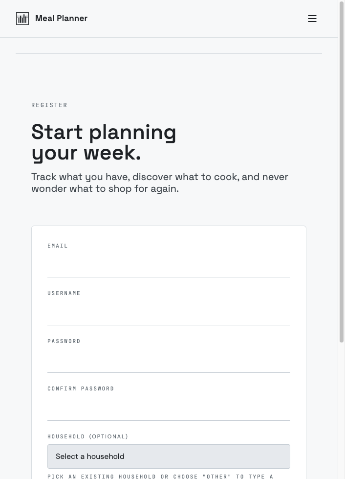

### Sign In

Choose **Sign In** from the nav. You can enter either your **username or email**
and your **password**. Case is normalized automatically.

If you belong to multiple households, the form lets you pick which one to enter
this session; otherwise the dropdown stays on your default.

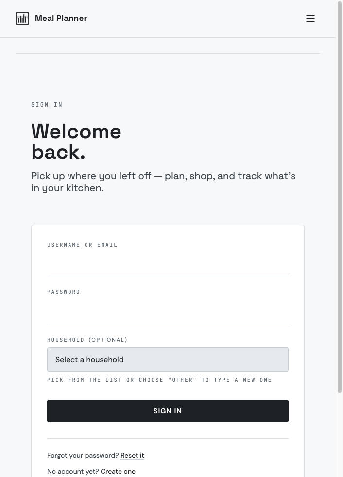

### Password Reset

The **Reset it** link on the sign-in form opens an immediate, in-app password
reset flow — no email round-trip required for local/dev deployments.

---

## 2. Home Dashboard

The home page is the springboard. When signed out, it presents the marketing
hero with **Get Started** and **Sign In** CTAs. When signed in, it greets you
by username and surfaces one button per app area, numbered 01–06 in priority
order:

1. **Weekly Planner** — plan meals for the week
2. **Recipes** — browse and manage recipes
3. **Inventory** — track household items
4. **Shopping List** — generate and manage lists
5. **What Can I Make?** — discovery with inventory
6. **Recipe Reviews** — reconcile ingredients

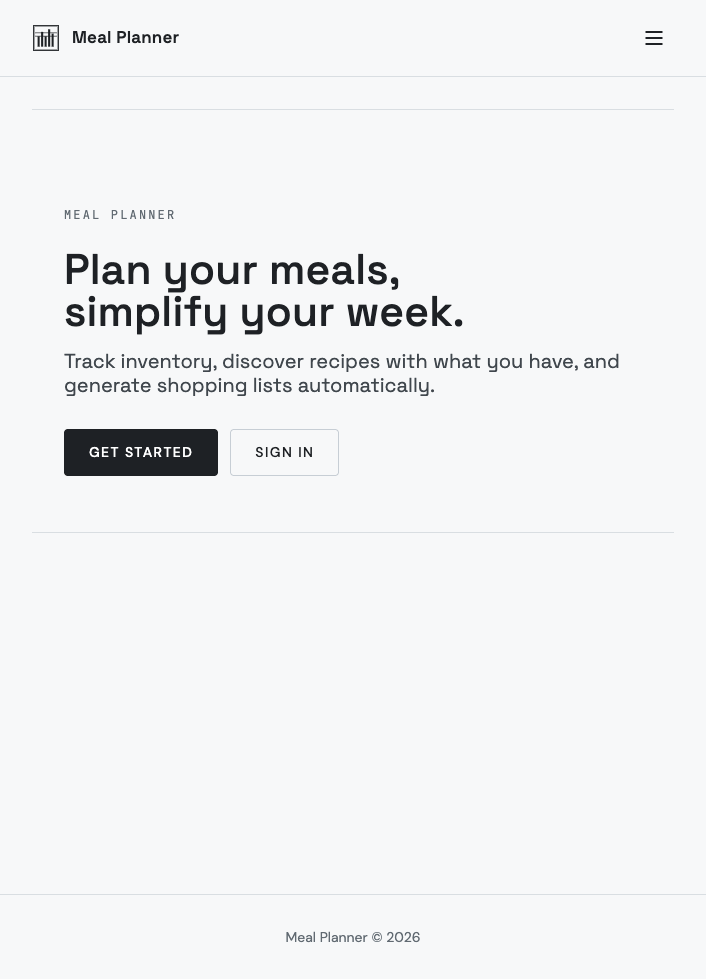
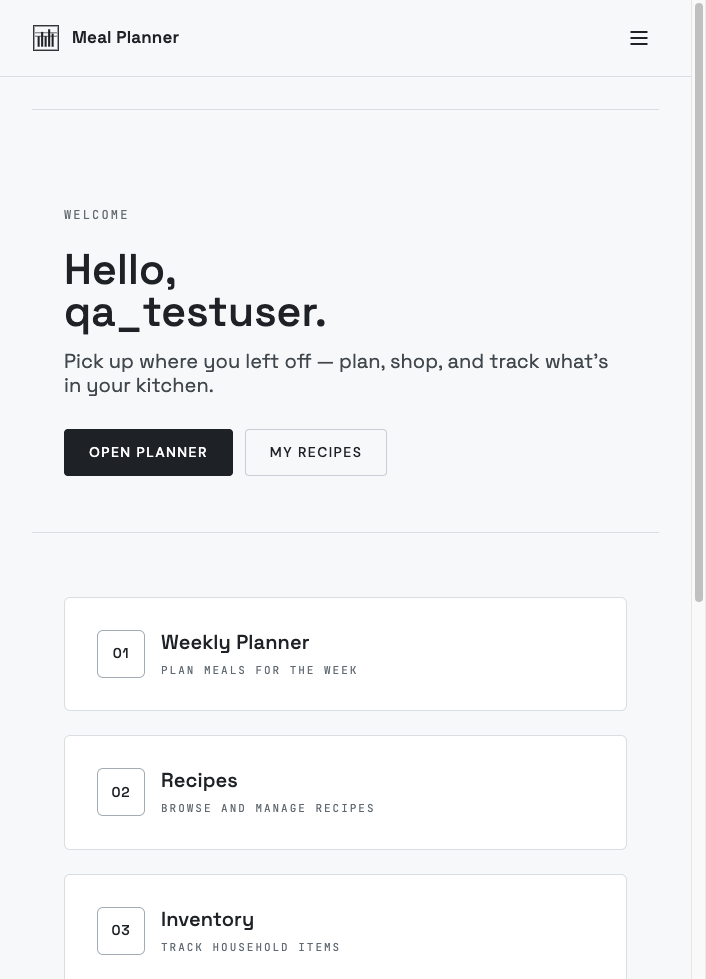

---

## 3. Weekly Planner

The planner is a Monday-to-Sunday grid with three meal slots per day
(breakfast, lunch, dinner). The header shows the current week range plus
left/right navigation arrows and a **Today** shortcut.

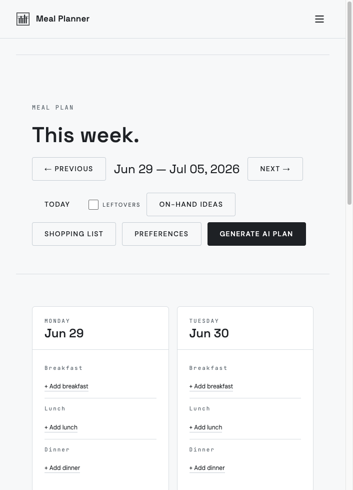

### Toolbar

- **Leftovers toggle** — when on, leftover meals from previous days stay visible
  on the plan
- **On-Hand Ideas** — jumps to the on-hand ideas page
- **Shopping List** — jumps to this week's shopping list
- **Preferences** — opens the meal preferences form
- **Generate AI Plan** — kicks off an AI planning pass for the week

### Adding Meals

Each empty slot shows a `+ Add breakfast / + Add lunch / + Add dinner` link.
Clicking it opens the meal form bound to that date and slot where you can:

- Link an existing recipe (with side dishes)
- Enter a custom meal name (no recipe)
- Mark leftovers
- Rate a meal after it has been cooked

### Editing and Rating

Existing meals can be edited inline (move to a different day or slot, swap
recipe, add side dishes) and rated post-cook.

---

## 4. Recipes

### Recipe List

Browse every recipe belonging to your household. The page includes:

- **Search** by title or description
- **Sort** by Newest First, Oldest First, Highest Rated, or Title A-Z
- **Import from YouTube** — opens the LLM import flow
- **+ Add Recipe** — opens the manual create form
- A **pending review** badge appears on recipes awaiting reconciliation

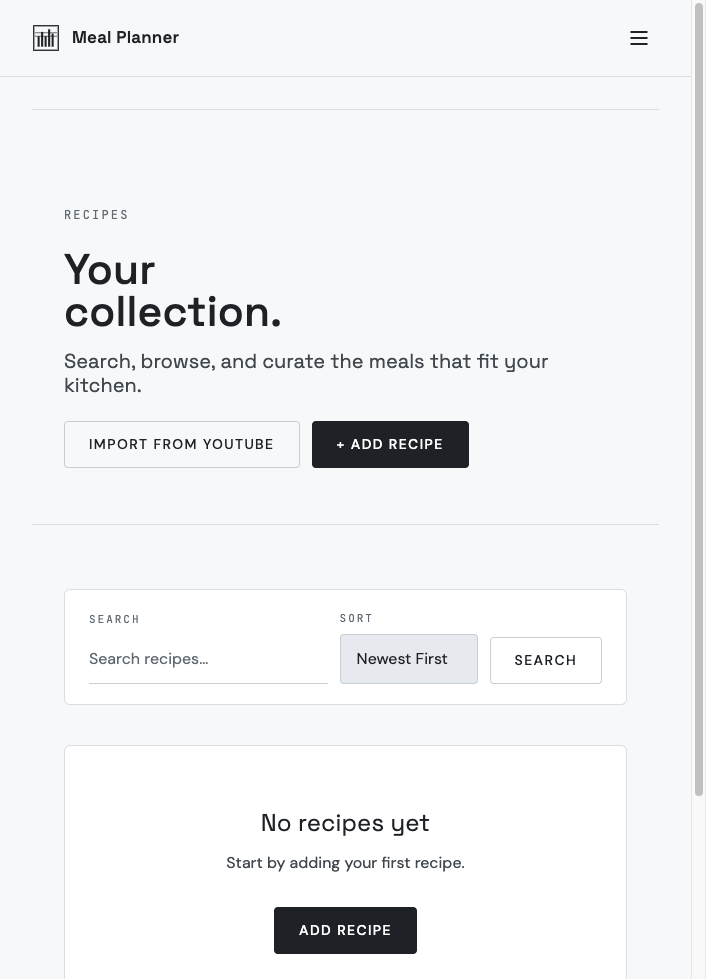

### Recipe Detail

Click a recipe card to see the full description, ingredients with quantities,
step-by-step instructions, tags, the average rating, your personal rating,
and any embedded video URL. Calories/servings and nutrition facts (protein,
carbs, fat) appear when ingredient data is linked to inventory items.

### Creating Recipes

`/recipes/new/` opens the manual create form. Fields include title,
description, an ingredients table (name, quantity, unit), an ordered list of
instructions, optional video URL, and tags.

### Editing and Deleting

Standard update / delete flows with a confirmation page for destructive
actions.

### Importing from YouTube (LLM)

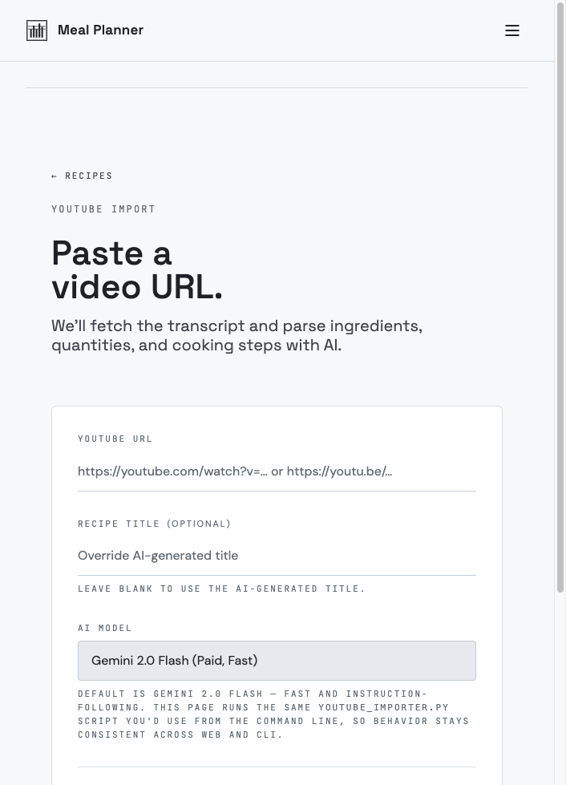

Paste a YouTube URL and the app routes the request through
`youtube_importer.py` to fetch the transcript and ask the LLM to extract
structured recipe data: title, description, ingredients, and steps. The
imported recipe enters the **review queue** so you can verify the parsed
ingredients against your inventory before publishing.

### Importing from an Image

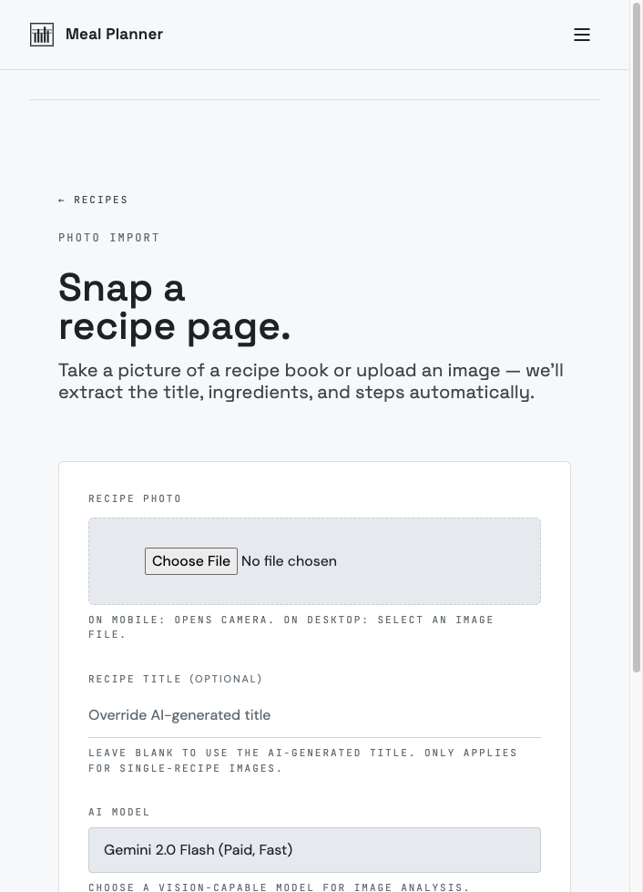

Upload a recipe photo (a screenshot, cookbook page, or handwritten card) and
the app runs OCR + LLM extraction to produce a recipe. Like YouTube imports,
image imports also flow through the review queue before going live.

---

## 5. Inventory

### Inventory List

The list page shows every item in your household's stock with category,
location, quantity, expiration date, and last-touched timestamp.

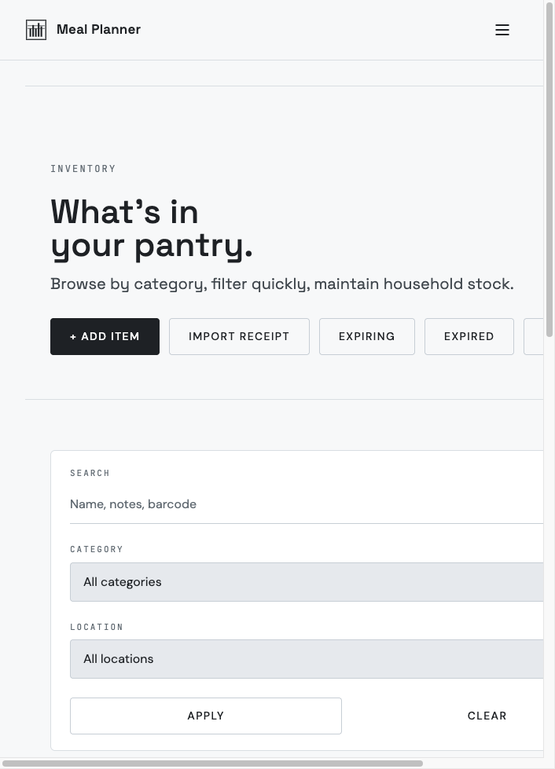

The toolbar offers:

- **+ Add Item** — manual create form
- **Import Receipt** — open the receipt import flow
- **Expiring / Expired** — quick-jumps to the timed views
- **Stores** — manage the store catalog

A filter card underneath supports search by name/notes/barcode plus category
and location dropdowns.

### Adding Items

The manual add form collects: name, quantity, unit, category, location,
optional price, optional expiration date, optional barcode. Negative quantities
are rejected; zero is allowed (so you can track depleted stock).

### Barcode Scanning

`/inventory/barcode/` accepts two entry modes:

- **Manual** — type or paste the 8–14 digit UPC/EAN
- **Camera** — start the on-device scanner (works on phones and laptop webcams)

Lookup order: household inventory first, then **Open Food Facts**, then
**UPC Item DB** as a fallback. A successful match shows the product name,
brand, size, and category and offers a **Create Item** action.

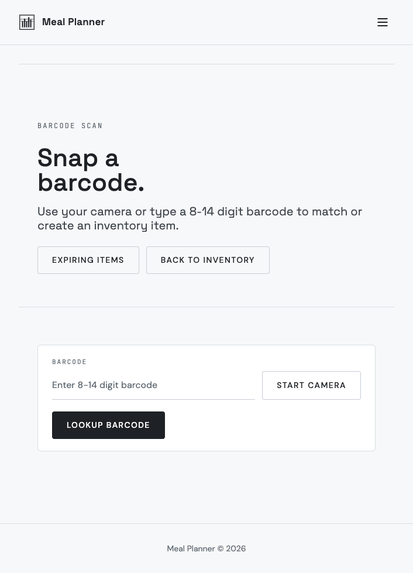

### Receipt Import

`/inventory/receipt/import/` lets you upload a grocery receipt photo. The
parser extracts line items, then the review step (`/inventory/receipt/review/`)
lets you clean up quantities and confirm items before they are added to
inventory.

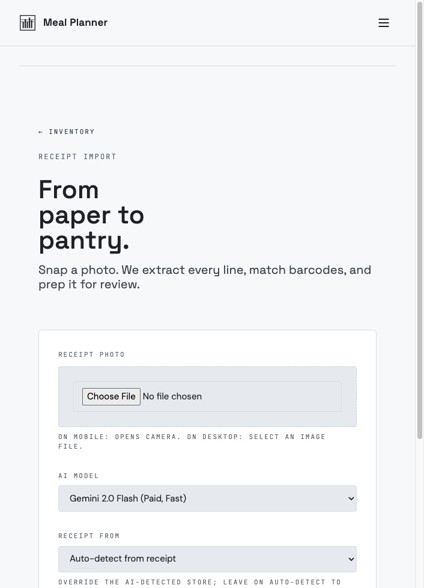

### Expiring & Expired

- **Expiring Soon** highlights items within your household's threshold
- **Expired** lists items past their expiration date

Both views respect your household's configured expiration threshold days.

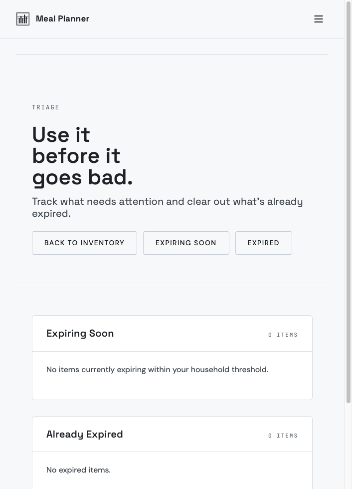

---

## 6. Shopping List

The shopping list page (`/shopping/`) defaults to the current Monday-to-Sunday
week and shows the date range in the header, with **← Previous / Next →** arrows
to move between weeks.

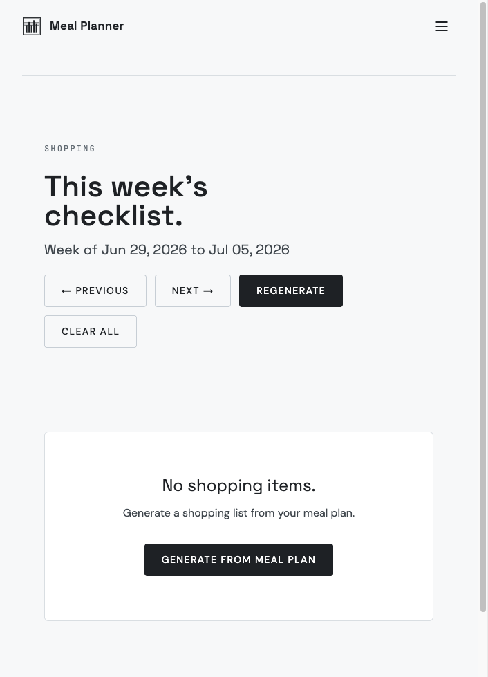

### How Lists Are Built

When you click **Generate from meal plan** or **Regenerate**, the app:

1. Reads every meal plan in the selected week
2. Resolves their ingredient lists from linked recipes (and AI-generated meals)
3. Subtracts on-hand inventory by name
4. Converts units to canonical forms (e.g., cups → milliliters) to aggregate
5. Persists the resulting list scoped to your household

### Per-Item Actions

- Check off items as you buy them
- Delete a single item
- **Clear All** removes everything for the week (after confirmation)
- **Regenerate** rebuilds from scratch against the latest meal plan and
  inventory

---

## 7. Discovery — What Can I Make?

`/shopping/discovery/` ranks every recipe in your household against current
inventory. For each match it surfaces:

- **What % of ingredients you already have**
- **Which ones you are missing**
- **Urgency flags** — recipes that use items expiring soon or already expired
  float to the top so you can prioritize them

A small badge in the hero shows the count of urgent matches in the next 7
days.

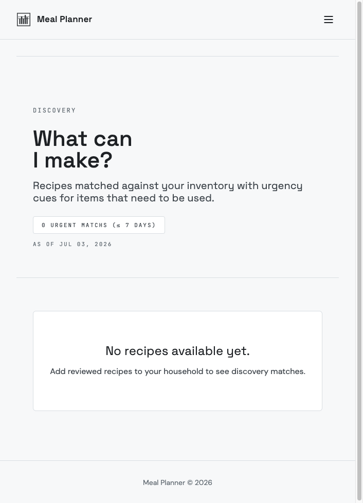

---

## 8. Cooking & Reconciliation

After a meal has been cooked, the **Cooking Queue** (`/cooking/`) lists meals
ready to be reconciled. Open one to mark which ingredients were used and which
need to be deducted from inventory.

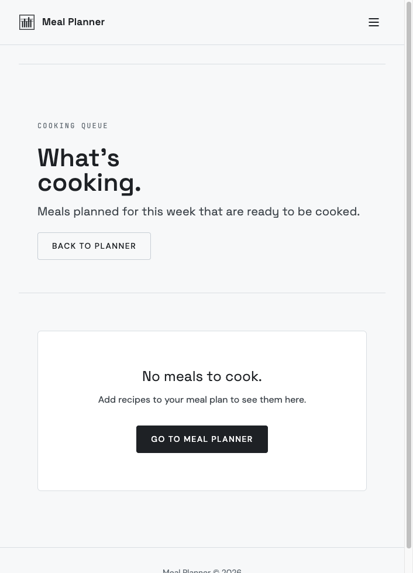

The reconciliation view lets you tick off ingredients used; the app then
writes back the consumption to inventory and clears the meal from the queue.

---

## 9. On-Hand Ideas

`/on-hand/` collects recipes that you have flagged as "I can make this with
what I already have right now."

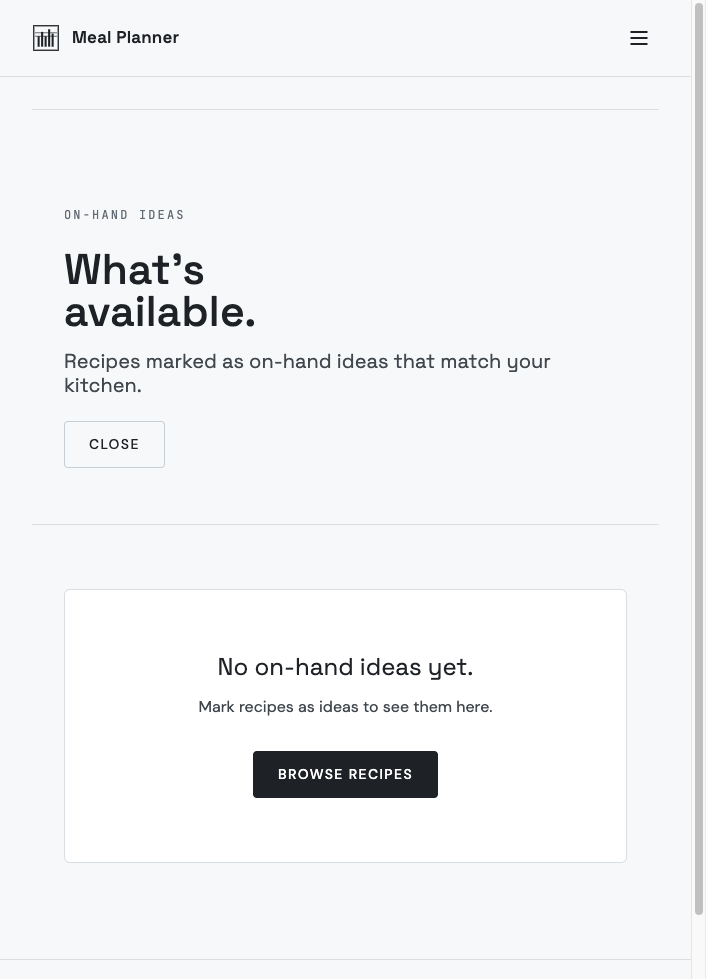

Use this as a quick decision surface during the week — when you have only a
partial week of meals planned and want to fill a slot without a shopping trip.

---

## 10. Recipe Review Queue

Imports — whether via YouTube URL or image — land in `/reviews/queue/` rather
than going straight into the live recipe list. The queue's purpose is to let
you link each extracted ingredient to a real inventory item (or mark it free-
form) before the recipe is marked ready.

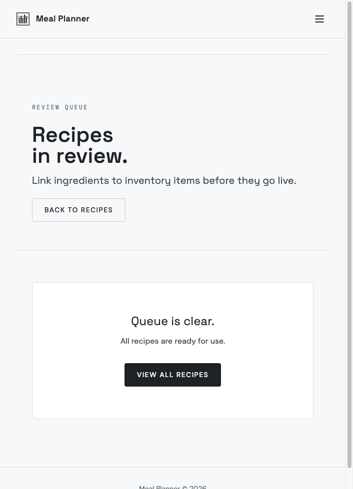

From the queue you can open the reconcile view for a single recipe, fix
ingredient matches, and then mark it **Ready**. Once ready, the recipe
appears on the home page review card (if its household has pending reviews)
and is available for the planner.

---

## 11. AI Meal Planning

The planner's **Generate AI Plan** action kicks off an AI planning pass for
the current week:

1. Reads your **meal preferences** (meals per week, prep time, dietary style)
2. Looks at what is expiring soon in inventory
3. Proposes a week's worth of meals — either reusing existing recipes or
   filling gaps with custom AI meals

You land on an **AI plan review** screen where each day shows the proposed
meals plus a per-day action (accept, replace, regenerate):
- **Accept** keeps the day as-is
- **Replace** regenerates just that day
- **Regenerate** rerolls the entire plan

When you accept, the plan is saved into regular meal plans and contributes
to the next shopping-list generation just like human-authored meals.

---

## 12. Meal Preferences

`/preferences/` lets you tune how the AI builds plans and how the discovery
view ranks recipes:

- **Meals per week** — how many dinners you want AI to plan
- **Prep time preference** — quick, moderate, leisurely
- **Dietary style** — broad dietary preferences applied to AI generation
- **Cuisine leans** — optional flavor preferences

Changes here affect subsequent AI plan generations; they do not retroactively
re-rank existing meal plans.

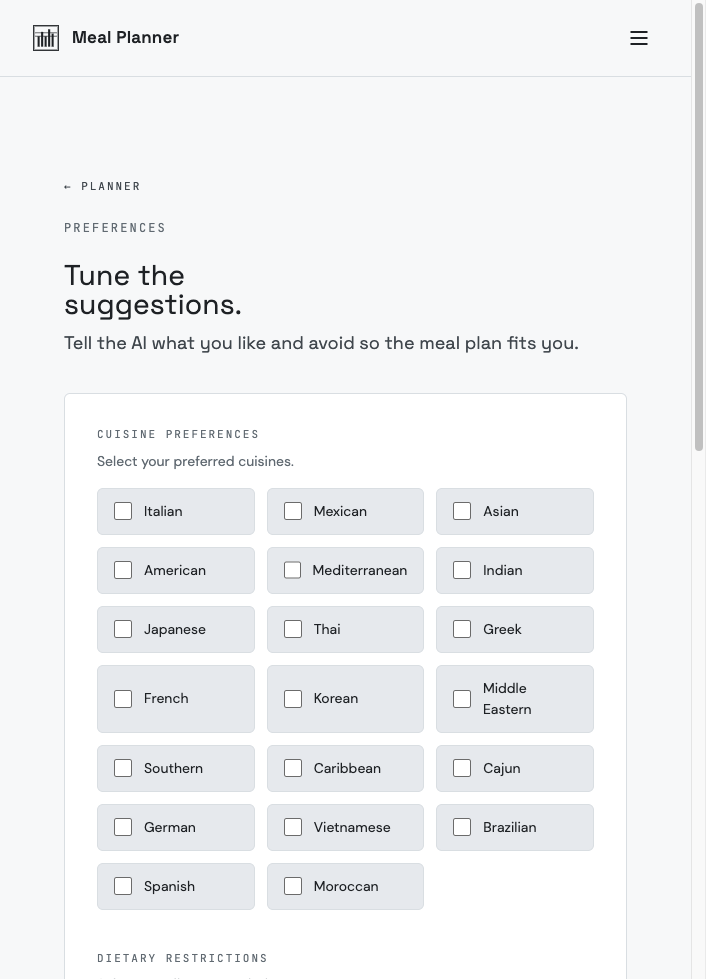

---

## 13. Stores

`/inventory/stores/` is a small catalog of the stores where you shop. Adding
a store lets you associate inventory items with the store you bought them at,
which makes it easy to plan shopping trips by store.

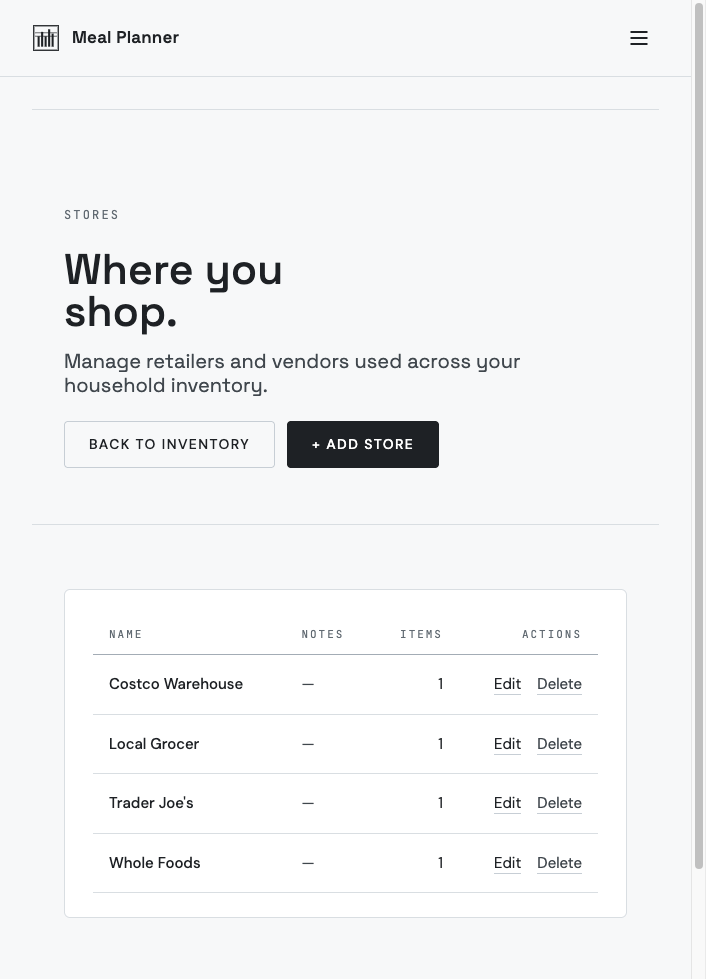

---

## 14. Backup & Restore

`/tools/backup/` exports or imports your data as a single JSON file.

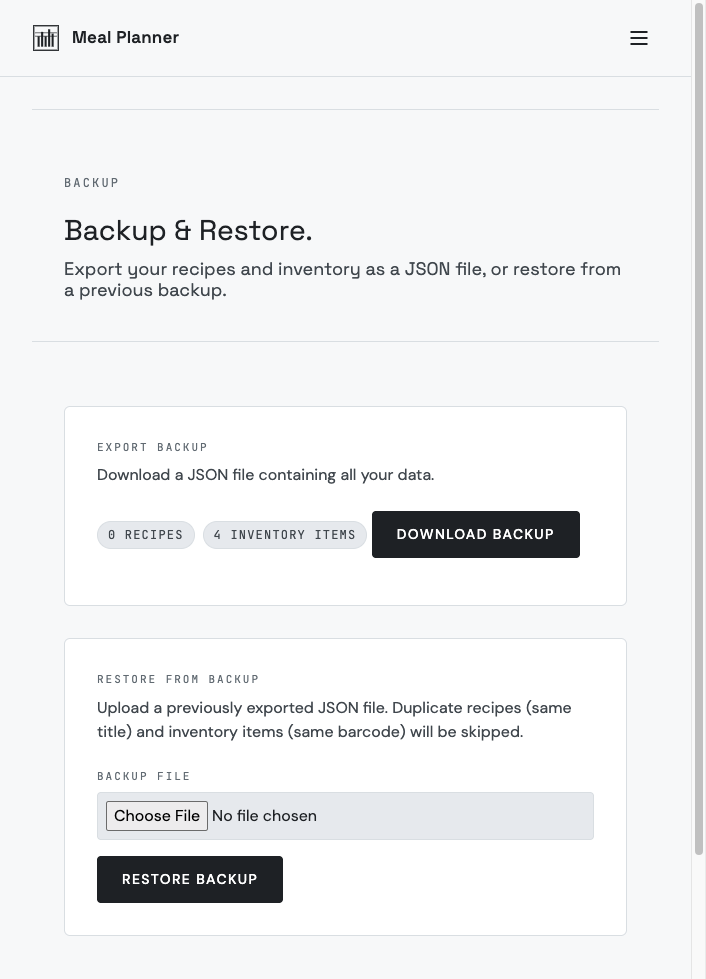

### Export

Click **Download Backup** to receive a `meal_planner_backup_<timestamp>.json`
containing your household's recipes, ingredients, ratings, inventory items,
shopping lists, and review queue state.

### Restore

Upload a previously exported JSON. Duplicates are de-duplicated transparently:

- Recipes with the same title are skipped
- Inventory items with the same barcode are skipped
- Other items are added alongside existing data; nothing is overwritten or
  deleted

### Recommended Use

- Periodic off-machine backups
- Migrating from one deployment to another
- Sharing a starting recipe set with another household

---

## 15. UPC Lookup Usage

`/tools/upc-usage/` is a small admin/operational view for monitoring how
much of your daily/monthly UPC lookup budget the household has consumed
across Open Food Facts and the UPC Item DB fallback. Useful when you notice
barcode lookups failing and want to check whether you are rate-limited.

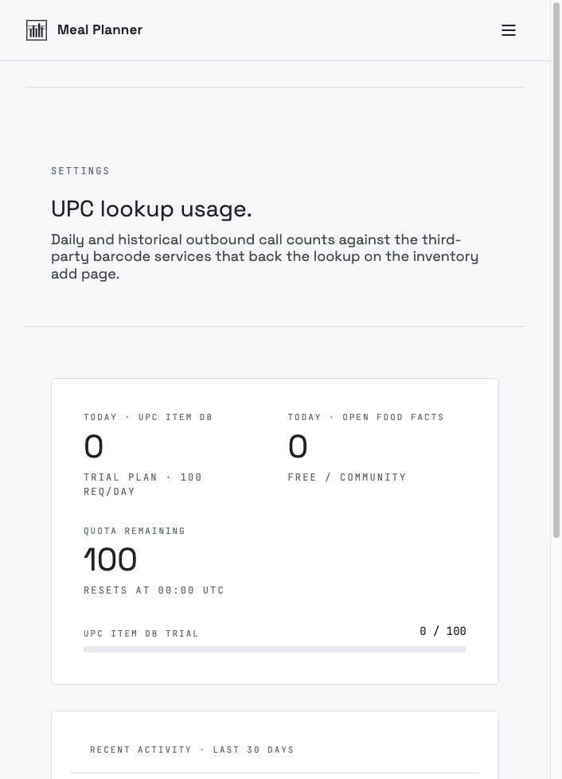

---

## 16. Reference: Data Scope

All data in MealPlanner is scoped to your household. Concretely:

- Recipes, meal plans, inventory, shopping-list weeks and items, ratings,
  reviews, and preferences are isolated per household
- Multi-household users pick their active household at sign-in
- All routes (unless explicitly noted) read and write only the currently
  active household's data

This makes it safe to share a deployment with family or roommates without
worrying about cross-household visibility.

---

*This manual reflects the in-app behavior observed on a live deployment as of
the latest screenshot pass. File paths and feature names map directly to the
running app under `127.0.0.1:8000`.*
